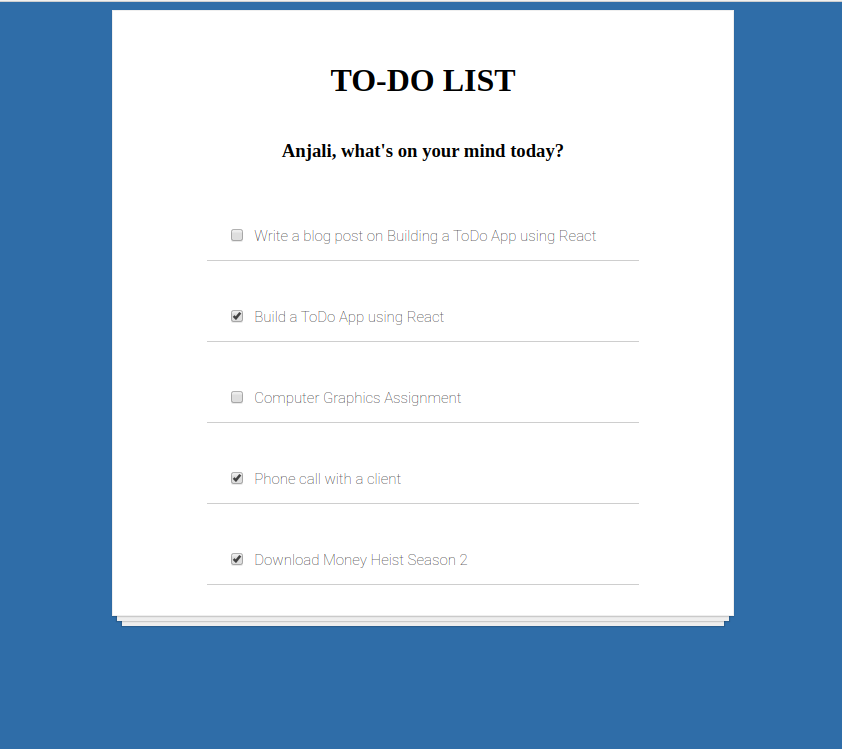
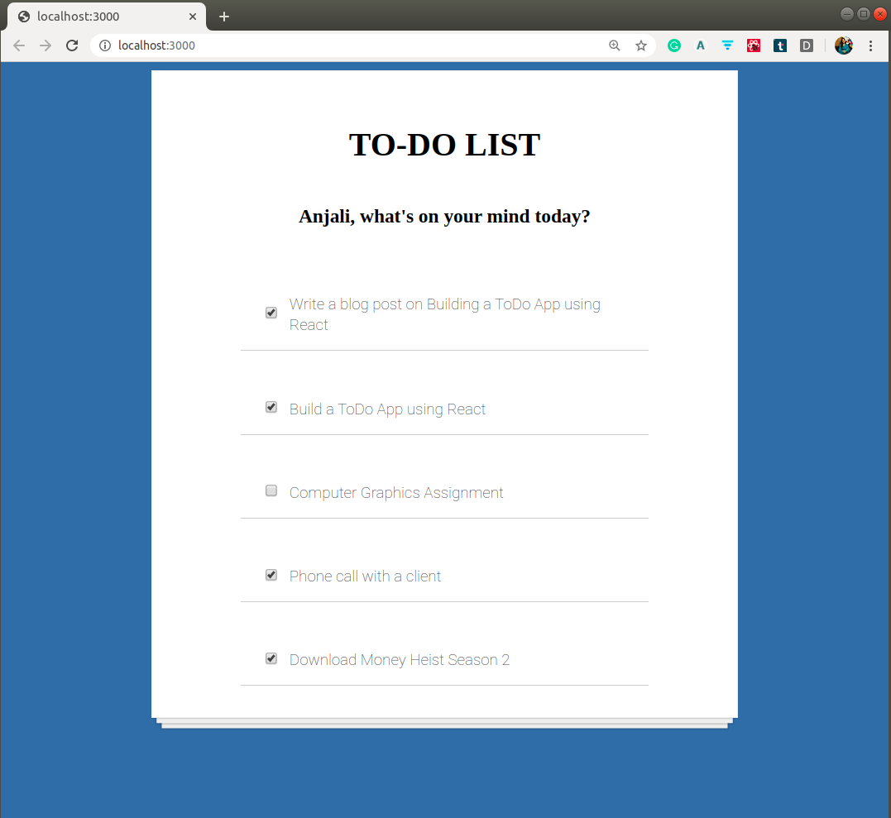

# React To-Do App

   

A simple To-Do App to understand the basic functionality of React and related concepts

This is motivated by [Scrimba](https://scrimba.com/).

## Screenshot of the To-Do App

## Tutorial Blog Post

The following is my tutorial blog post on ["Learn React by building a To-Do App — React Functionalities Explained"](https://medium.com/mobile-web-dev/learn-react-by-building-a-to-do-app-react-functionalities-explained-74f466e9396)

So finally, most of the todos for the day are done except the assignment(as always)!

## Project Admin

 

|  |
| :----------------------------------------------------------: |
| **[Anjali Sharma](https://www.linkedin.com/in/anjalisharmaaa/)**  |

For more details visit my portfolio at anjalisharma.tech 

  

